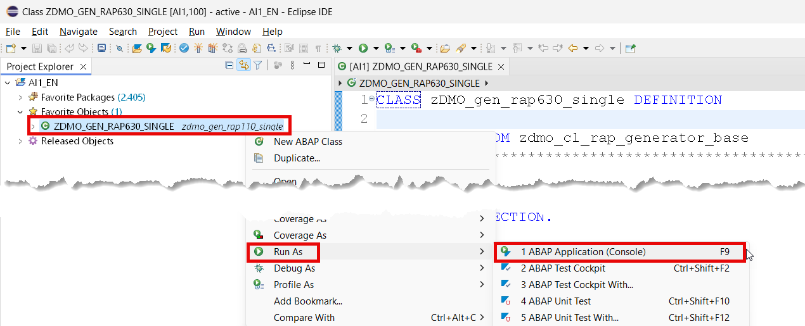
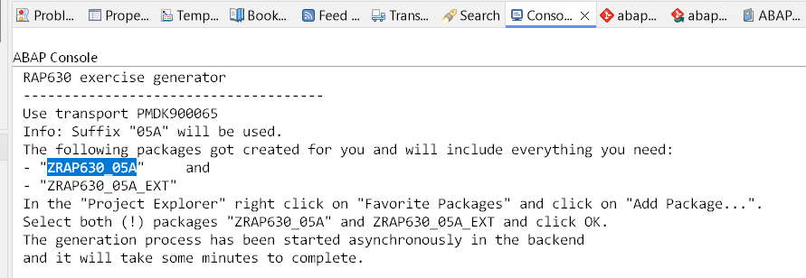
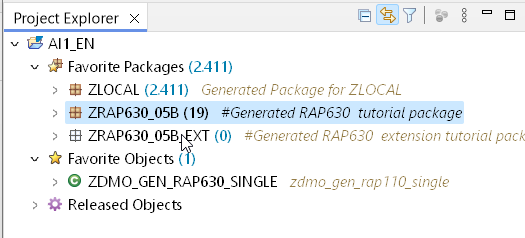

[Home - Cloud ERP Extensibility](../../README.md#-exercises)

# Getting started

In this exercise, you will start a helper class that will generate several artefacts needed for the remaining exercises.

<!--  
> For **⚠  SAP lead events** users   
> Please skip the following step, because the packages have been pre-generated for convenience in the dedicated workshop system.   
-->   

You will use class `ZDMO_GEN_RAP630_SINGLE` to generate two packages. 

> ⚠️ Please note that if you don't find this class you have to import the openSource RAP Generator first as described in the 
> section [Getting started](../../README.md#requirements-for-attending-this-workshop)  

The first package `ZRAP630_###` will contain an extensible RAP business object which you will extend in exercise 2.

You will use the second package `ZRAP630_###_EXT` to store the objects that you are going to create in Excerise 1 and Exercise 2.

1. Right-click **Favorite Objects** and click **Add Object**.
   
2. Search for **`ZDMO_GEN_RAP630_SINGLE`**, select it and click **OK**.    

3. Right-click **`ZDMO_GEN_RAP630_SINGLE`**, select **Run As** > **ABAP Application (Console) F9**.

   

4. Now your packages `ZRAP630_###` and `ZRAP630_###_EXT` will now be created   
   (where the suffix `###` denotes your group number and will contain everythin g you need).   

   > ⚠ **The generation process will take a few minutes.**   
   > ⚠ So, stay tuned and check the ABAP console.     

   

5. **⚠Note down the suffix `###` for later use.**

6. In the "Project Explorer" right click on **Favorite Packages** and click on **Add Package...**.   
   Enter `ZRAP630_###` and and select **both** packages and click OK. 
 
   
 
## Summary

Now that you have generated your own extensible RAP business object you can continue to - [Exercise 1](../ex1/README.md)
