[Home - RAP630](../../../../#exercises)

# Exercise 1: Find, examine and use a released RAP BO in a custom application (Developer Extensibility)

## Introduction

In this exercise, you will search for a released RAP business object to create a bank. For this we will *Released Objects* part of the *Project Explorer* in ADT.

We will continue to create a simple class to investigate 

- How ABAP cloud restricts the use of not released APIs
- How ABAP cloud restricts the use of outdated ABAP statements that are not part of the ABAP language version *ABAP for Cloud Development*   

We will then use this class to build a test class to call the released API **I_BankTP**.  
 
> **Reminder:**   
> Don't forget to replace all occurences of the placeholder **`###`** with your group ID in the exercise steps below.  
> You can use the ADT function **Replace All** (**Ctrl+F**) for the purpose.   
> When you don't know your group number anymore you can check the transport that has been created when you repository objects have been generated. 
> Here you can check for example the name of the generated package.
>
> 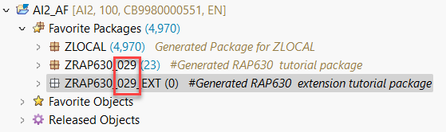

## Exercise 1.1: Create a class to test ABAP Cloud governance
[^Top of page](#)

> Create a class  in the extension package `ZRAP630_###_EXT` to test the effects of using the language version *ABAP for Cloud Development*.   

 

  
Click to expand!

   1. Right-click on your ABAP package **`ZRAP630_###_EXT`** and select **New** > **ABAP Class** from the context menu.

      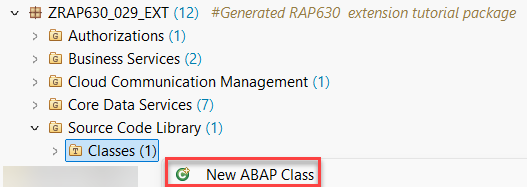. 
  
   3. Maintain the required information (`###` is your group ID).
      - Name: **`zcl_test_abap_cloud_###`**
      - Description: _**`Test ABAP Cloud Governance`**_                  

      Click on **Add** and select the interface `if_oo_adt_classrun` and press OK. 

      and click **Next >**

      . 

   4. Select or create a transport request, and click **Finish** to create the class.
   
   5. Copy the code snippet provided below and add it in the implementation section of the methode `main`. 
 
      > **Hint**: Hover the code snippet and choose the _Copy raw contents_ icon  appearing in the upper-right corner to copy it. 
      
 <pre lang="ABAP">
   METHOD if_oo_adt_classrun~main.
    CALL FUNCTION 'POPUP_TO_CONFIRM'.

    SELECT SINGLE * FROM bnka WHERE banks = 'DE' INTO @DATA(bank_info).

    DATA bank_address  TYPE bapi1011_address.
    DATA bank_ctry  TYPE banks  .

    CALL FUNCTION 'BAPI_BANK_CREATE'
      EXPORTING
        bank_ctry    = bank_ctry
*       bank_key     =
        bank_address = bank_address
*       bank_method  =
*       bank_formatting              =
*       bank_address1                =
*       i_xupdate    = 'X'
*       i_check_before_save          =
*       bank_iban_rule               =
*       bank_b2b_supported           =
*       bank_cor1_supported          =
*       bank_r_transaction_supported =
*       bank_internal_bank           =
*       i_no_overwrite               =
*  IMPORTING
*       return       =
*       bankcountry  =
*       bankkey      =
      .

    SELECT * FROM I_Bank_2
    WHERE BankCountry = 'DE'
    INTO TABLE @DATA(bank_data_from_bnka).

  ENDMETHOD.
 </pre>

      The ABAP class `zcl_test_abap_cloud_###` in the screenshot underneath uses the ABAP Cloud development model (ABAP language version “ABAP for Cloud development”). The class cannot be compiled because of several ABAP statements containing syntax-errors:

      - Line 19: The SAP function module `POPUP_TO_CONFIRM` is used in the classic Dynpro/SAP GUI world and is no public SAP API in the ABAP Cloud development model.  
  
      - Line 21: Direct access to SAP table `BNKA` is also not allowed. Here (in Steampunk) the devloper already gets a hint to use the public CDS view `I_BANK_2` instead.
  
      - Line 22, 23: Use of the SAP structure `bapi1011_address` and the data element `banks` are also not allowed. 
 
      - Line 26: The use of the SAP function module `BAPI_BANK_CREATE` is also forbidden in the ABAP Cloud development model, but for this function module a successor is available, namely the Behavior Definition `I_BANKTP`.   
          
      - Line 48: Valid access to CDS view `I_Bank_2`. 
             
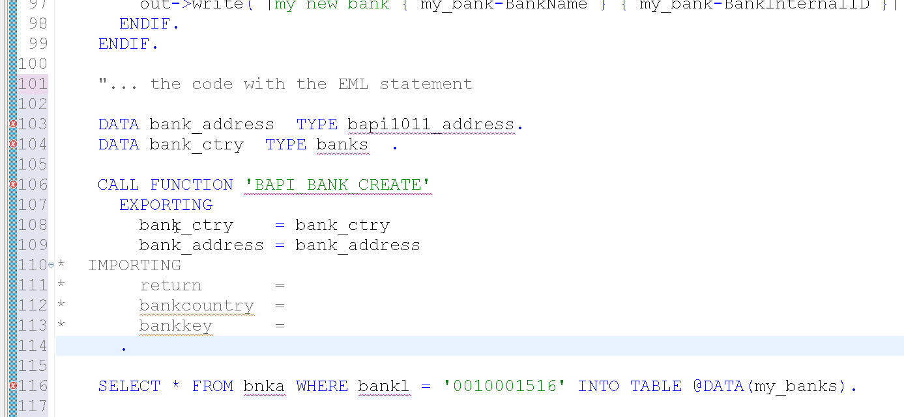. 
      
   6. The effect of the release state **Not to Be Released** in combination with a successor is illustrated below for the table `BNKA`, which was replaced by the CDS view `I_BANK_2`. When you open an object such as `BNKA` for which a success is maintained you see this information also in the **Properties** in ADT where you have the option to conveniently navigate to the successor object.   
   
   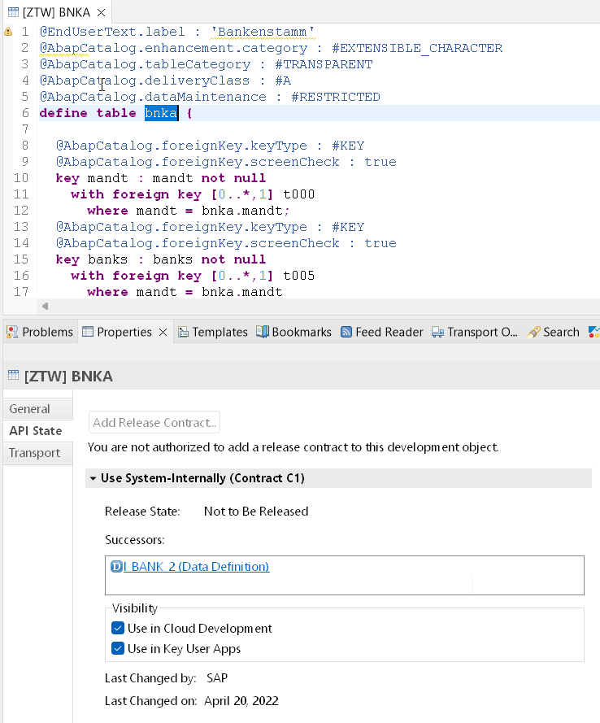. 
 
  6. In order to activate your class you have to comment out the forbidden statements. 
  
  7. What you can do if the use of an object is not permitted but now successor has been maintained in the current release is described in the following exercise. 

 

 ## Exercise 1.2: Check the documentation for I_BankTP
 
[^Top of page](#)

The documentation for a released RAP business object can be found in so called **Knowledge Transfer Documents** which have the same name as the business object (released API) it describes.     

 

  
Click to expand!

  1. You can find the **Knowledge Transfer Document** of a realeased API in the folder **Documentation** underneath the business object in the Project Explorer.
  It can also be opened from within the source code editor of your behavior definition. Here you find the link at the top of the source code of the behavior definition.

  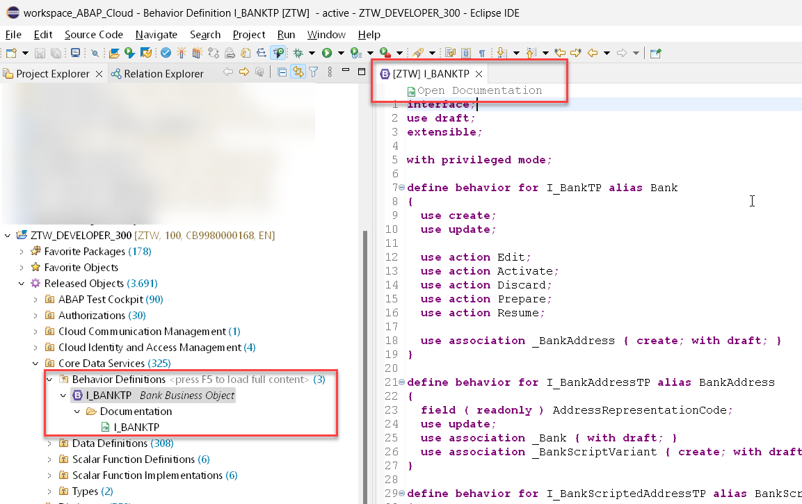 

  2. The **Knowledge Transfer Document** can also be opened directly via the **Open Development Object** dialogu that can be opened via the menu or via the short cut **Ctrl+Shift+A**.  

   

  3. When you have opened the **Knowledge Transfer Document** you should change from the **Source** tab to the more appealing visualization of the **Preview** tab.  

    

  4. The **Knowledge Transfer Document** provides you with code snippets that help you to write code to perform the operation (e.g. *create* as shown below) or an action which is supported by this business object.  

  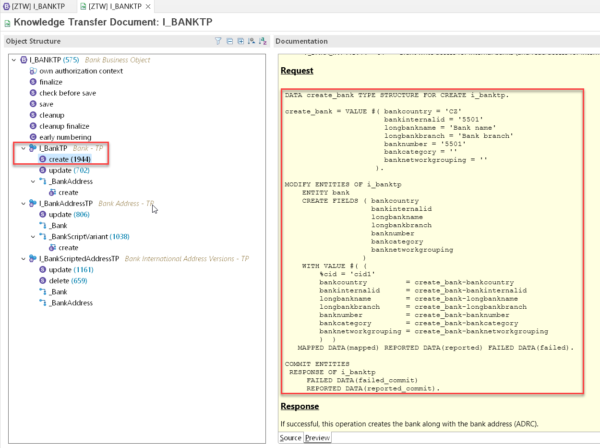     

We will use these code templates to create a test class that calls the API **I_BankTP** in order to create purchase requisitions in the following Excercise.

We will reuse this code in the implementation of the behavior definition class of our sample RAP business object **OnlineShop**. 

 
 

## Exercise 1.3: Implement a test class to call I_BankTP
[^Top of page](#)

In the preceeding exercise you have learned how to access the documentation of a released RAP business object.  

We will use this code to implement a test class that calls the API **I_BankTP** and that implements the interface **if_oo_adt_classrun** so we can start with basic tests by simply starting the `if_oo_adt_classrun~main( )` method of our test class by pressing **F9**.

The coding leverages the `response` parameter of EML statements that is used to specify response parameters for ABAP EML statements to get information on the following: 

- Failures, i. e. operations that could not get processed (FAILED failed_resp)   
- Key mapping information (MAPPED mapped_resp)   
- Returned error messages (REPORTED reported_resp)

 

  
Click to expand!

  1. Open the test class **zcl_test_abap_cloud_###** that you have created before by pressing **Ctrl+Shift+A**.    

     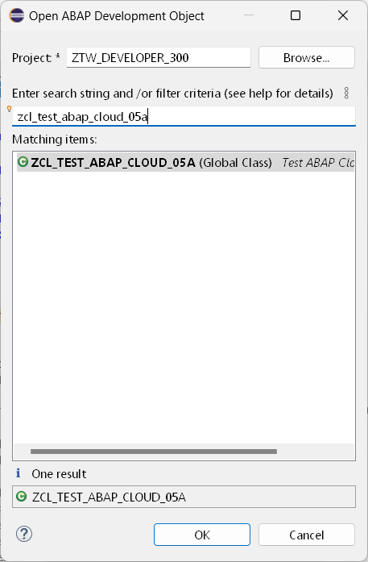  

  2. Replace the code in the `if_oo_adt_classrun~main( )` method with the following code snippet.    
 
     > Tip
     > You have to replace the value for **'####'** with a string that only contains numbers.   
  
     <pre lang="ABAP">  
     METHOD if_oo_adt_classrun~main.
     
      DATA create_bank TYPE STRUCTURE FOR CREATE i_banktp.
      DATA bank_id_number TYPE i_banktp-BankInternalID VALUE '8888'.

      create_bank = VALUE #( bankcountry = 'CZ'
                           bankinternalid = bank_id_number
                           longbankname = 'Bank name'
                           longbankbranch = 'Bank branch'
                           banknumber = bank_id_number
                           bankcategory = ''
                           banknetworkgrouping = ''
                           swiftcode = 'SABMGB2LACP'
                           ismarkedfordeletion = ''
                    ).

      MODIFY ENTITIES OF i_banktp
      ENTITY bank
      CREATE FIELDS ( bankcountry
                    bankinternalid
                    longbankname
                    longbankbranch
                    banknumber
                    bankcategory
                    banknetworkgrouping
                    swiftcode
                    IsMarkedForDeletion
                 )
       WITH VALUE #( (
       %cid = 'cid1'
         bankcountry         = create_bank-bankcountry
         bankinternalid      = create_bank-bankinternalid
         longbankname        = create_bank-longbankname
         longbankbranch      = create_bank-longbankbranch
         banknumber          = create_bank-banknumber
         bankcategory        = create_bank-bankcategory
         banknetworkgrouping = create_bank-banknetworkgrouping
         SWIFTCode           = create_bank-SWIFTCode
         IsMarkedForDeletion = create_bank-IsMarkedForDeletion
         )  )

       MAPPED DATA(mapped)
       REPORTED DATA(reported)
       FAILED DATA(failed).

      LOOP AT reported-bank INTO DATA(reported_error_1).
      DATA(exc_create_bank) = cl_message_helper=>get_longtext_for_message(
        EXPORTING
          text               = reported_error_1-%msg
        ).
        out->write( |error { exc_create_bank } |  ).
      ENDLOOP.

      COMMIT ENTITIES
      RESPONSE OF i_banktp
      FAILED DATA(failed_commit)
      REPORTED DATA(reported_commit).

      LOOP AT reported_commit-bank INTO DATA(reported_error_2).
      DATA(exc_create_bank2) = cl_message_helper=>get_longtext_for_message(
        EXPORTING
          text               = reported_error_2-%msg
      ).
      out->write( |error { exc_create_bank2 } |  ).
      ENDLOOP.
      IF reported_commit-bank IS INITIAL.
      COMMIT WORK.

      SELECT SINGLE * FROM I_Bank_2 WHERE BankInternalID = @bank_id_number INTO @DATA(my_bank).
      out->write( |my new bank { my_bank-BankName } { my_bank-BankInternalID }| ).
      ENDIF.
     ENDMETHOD.
     </pre>   

  3. Run the test class by pressing **F9**.  

     You will notice that an error message is thrown. Namely `error You are not authorized to create bank data for country/region CZ.` 
     Consequently also no new data is found. 

           
     
  4. Adding **PRIVILEGED** to the EML call

     We will now check the behavior definition of the Bank RAP business object. To do so use Ctrl+Shift+A to open the behavior definition `R_BankTP`.
     
     In the source code (see below) we see that the BDEF `R_BankTP` defines two so called authorization contexts:

       - _Own authorization context_ : Lists all authorization objects used by the RAP BO implementation.
       - _NoCheckWhenPrivileged_ : Lists authorization objects that can be skipped by a RAP BO consumer with privileged access.
      
     When we add the key word `PRIVILEGED` to our EML call the authorization checks for the authorization objects `F_BNKA_MAO` and `F_BNKA_INT` will basically be skipped.

     <pre>
     MODIFY ENTITIES OF i_banktp
     PRIVILEGED
     ENTITY bank
     CREATE FIELDS ( bankcountry
                    bankinternalid
                    longbankname
                    ...
     </pre>    
     
     When you now run the class again using F9 you will find that the creation of a new bank seem to have worked. However the select statement is not able to retrieve the newly created data.
     
     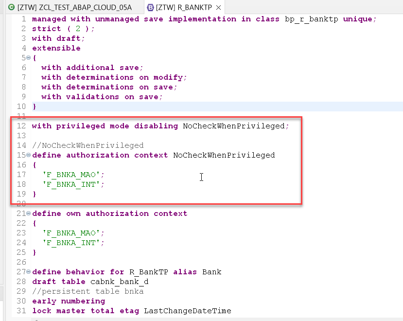  
     
  5. Adding **WITH PRIVILEGED ACCESS** to the ABAP SQL statement
  
     Similar to enforce skipping the authorization checks when creating a new bank it is also possible to enforce skipping of the authorization check that is imposed by the underlying DCL which performs a check on the authorization object `F_BNKA_MAO` and the field `BBANKS` for displaying data.  
     
     Open the DCL  and check its source code.        
     
        
     
     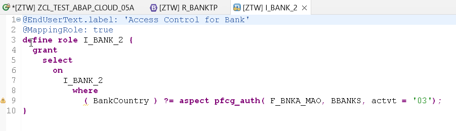   
     
     When we now change the ABAP SQL statement such that we add the key words ` WITH PRIVILEGED ACCESS` to it:   
     
     <pre>
       SELECT SINGLE * FROM I_Bank_2
       WITH PRIVILEGED ACCESS
       WHERE BankInternalID = @bank_id_number INTO @DATA(my_bank).
     </pre>
     
     we see that the data is now successfully been created and can also be read.  
     
  
     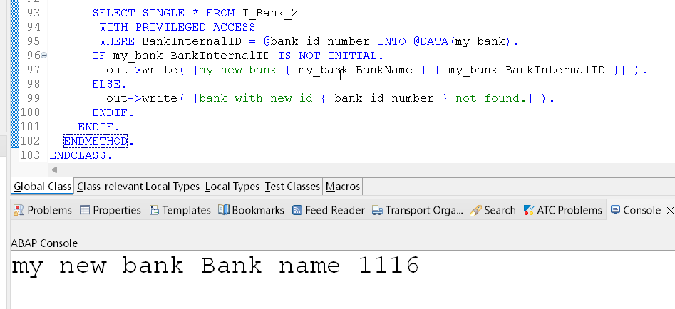   
     
  
  4. Other potential problems
  
     The I_BankTP RAP BO checks whether the provided switft code fits to the ISO code of the region. 
  
     - `error ISO code GB in the SWIFT code SABMGB2LACP is not correct for country/region US. Diagnosis Positions 5 and 6 of the SWIFT code do not correspond to the ISO code of country/region US. Procedure Check your entries. If necessary, check whether the ISO code of country/region US has been defined correctly.`  
       
       When a bank with the ID that is provided already exists you will receive an error message as well.

     - `error Bank CZ 8888 already exists.`
  
        

 
 

## Summary 
[^Top of page](#)

Now that you've...   
- have learned about the restrictions of *ABAP Cloud*,   
- and have implemented a simple test class for the released API **I_BankTP** , 
 
you can continue with the next exercise - **[Exercise 2](../ex2/#readme)**.

## Further Reading
[^Top of page](#)

  
Click to expand!

### No Information in your system ? --> Find information about Released API's in GitHub

While developing an ABAP Application for _S/4HANA on premise_ or _S/4HANA private cloud edition_ , you do get the following error message: "Use of <Object Type> <Object Name> is not permitted". 
 
But the error message does not provide a hint which API or object to use instead. The reason is that the successor information in on premise system does not contain the latest updates such as in SAP S/4HANA Cloud, ABAP Environment system or SAP BTP, ABAP Environment.   

An example would be the table `BNK2`.  

 You as a developer nevertheless want to find out which objects to use intstead and to check their documentation.   

 
  1. Check out the GitHub repository. 
  
     The repository contains the list of released APIs of S/4HANA Cloud. In addition also the objects that are not released are contained with the specification of successor objects. All objects are contained in one JSON file. This file is used as content for the ABAP Test Cockpit Check "Usage of Released APIs (Cloudification Repository)". This check can be used by customers and partners to analyse existing custom code concerning the usage of released and not released APIs on all ECC and S/4HANA releases. The check is available in SAP BTP, ABAP environment.
     
     [S/4 HANA Cloud - Released objects for ATC Check (Cloudification Repository)](https://github.com/SAP/abap-atc-cr-cv-s4hc).
     
 When we check the **csv file** that is public available we can retrieve a list of successors for the table BNKA.  
 
 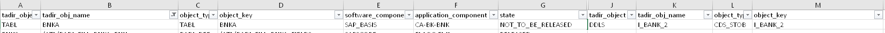  
   
 While csv files are nice for human beings, computers prefer json files.  
 
 [Link to json sample file](https://raw.githubusercontent.com/SAP/abap-atc-cr-cv-s4hc/main/src/objectReleaseInfo_2208.json) 
  
 
  

