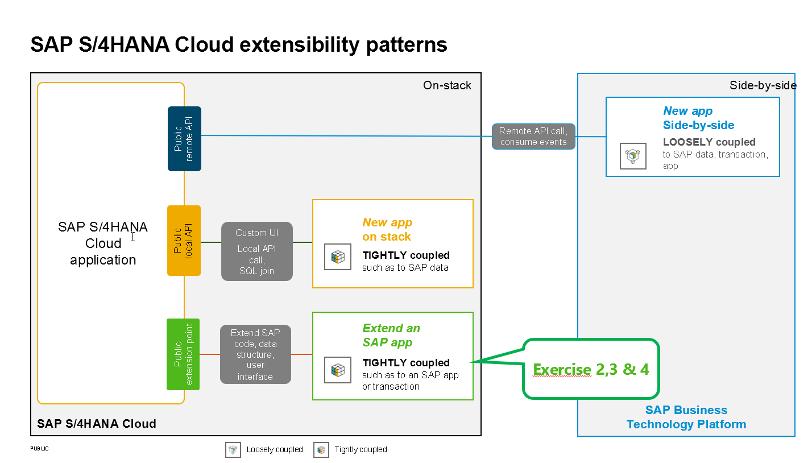
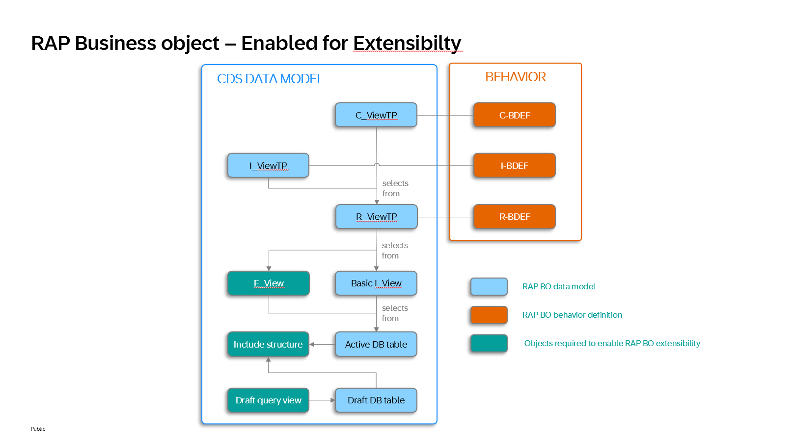

[Home - Cloud ERP Extensibility](../../../../#exercises)

# Excercise 2, 3 and 5 - Extend a RAP business object

In the following three exercises 2,3 and 4 you will extend a RAP business object.  

   

Since extending a RAP business object in parallel by several developers can cause severe problems, every participant will work with his or her own base RAP business object. For your convenience an extensible RAP BO has thus been generated using the class `zdmo_gen_rap630_single` that you have run in the [Getting started](../ex0/README.md) section.

In addition to the repository objects that are required for a normal RAP business object a RAP business object that has been enabled for extensibility requires three additional repository objects for each entity.   

- Extension include  
- Extension include view   
- Draft query view
    
   

