# Exercise 3 - Extend the CDS data model of the extensible RAP base business object  

In the preceeding exercise we have extended the _behavior_ of the based RAP BO by adding a determination, a validation and a side effect. 

We will now adapt the _CDS data model_, that means we will add new fields to the _Shop_ entity. 

Compared to the activities for adding additional behavior this is a larger amount of work since the complete stack of CDS views has be extended rather than only extensing the behavior definition (BDEF).

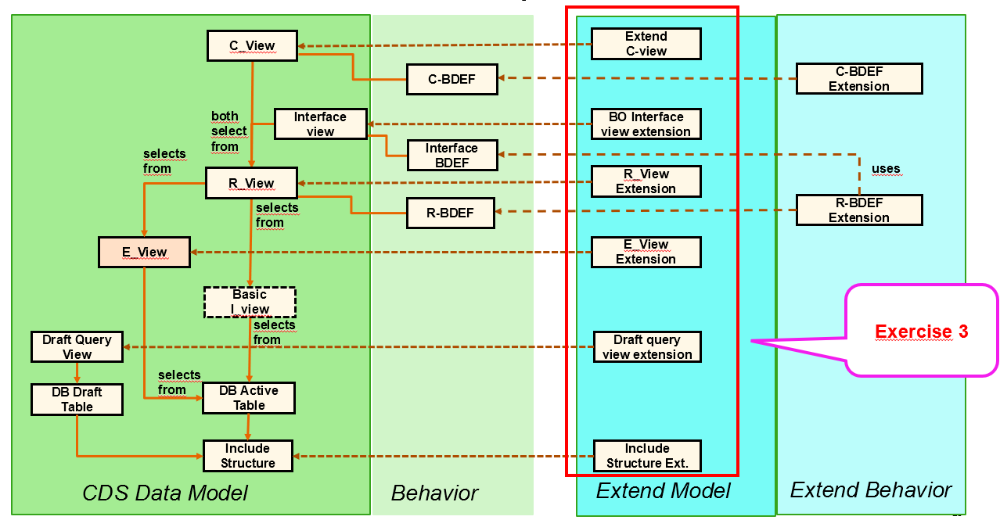

## Exercise 3.1 - Check (and adapt) the CDS data model (of the extensible base RAP BO)

In order to extend the data model of a RAP BO the base RAP BO must be enabled to support extensibility as described in the Online Help.  
[RAP Extensibility-Enablement](https://help.sap.com/docs/abap-cloud/abap-rap/rap-extensibility-enablement)

For your convenience we have generated such an extensible RAP BO `ZRAP630R_ShopTP_###` for you.

Unfortunately it was not possible to generate all required annotations (this is planned to be possible in an upcoming release 2402), so that you have to adapt the follwoing three objects 

- The database table:              `zrap630_ashop###` 
- The draft table:                 `zrap630sh00d_###`
- The extension include structure: `zrap630sshop_###`  

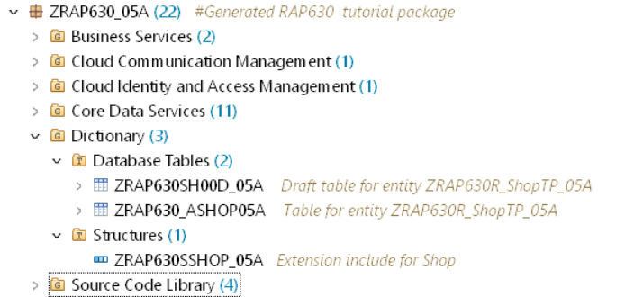  

<details>
  <summary>🔵 Click to expand!</summary>

### Adaption 3.1.1 - Adapt include structure of the RAP base object

We will start with adapting the generated include structure. 

<details>
  <summary>🔵 Click to expand!</summary>

1. Open the include structure

   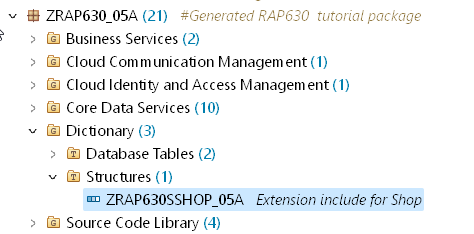   

1. Change the enhancement category such that the structure gets the enhancement category #EXTENSIBLE_ANY.   

   <pre>
    @AbapCatalog.enhancement.category : #EXTENSIBLE_ANY
   </pre>

   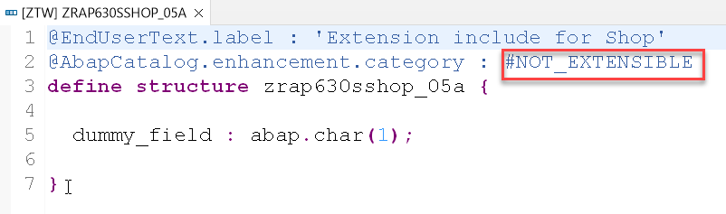 

2. Then add these annotations that are needed in order to make the generated inlcude structure extensible:  

   <pre>
   @AbapCatalog.enhancement.fieldSuffix : 'ZAA'
   @AbapCatalog.enhancement.quotaMaximumFields : 350
   @AbapCatalog.enhancement.quotaMaximumBytes : 3500
   @AbapCatalog.enhancement.quotaShareCustomer : 50
   @AbapCatalog.enhancement.quotaSharePartner : 50
   </pre>

3. **Result:** The code of the extension include should now look like as follows :

   <pre>
     @EndUserText.label : 'Extension include for Shop'
     @AbapCatalog.enhancement.category : #EXTENSIBLE_ANY
     @AbapCatalog.enhancement.fieldSuffix : 'ZAA'
     @AbapCatalog.enhancement.quotaMaximumFields : 350
     @AbapCatalog.enhancement.quotaMaximumBytes : 3500
     @AbapCatalog.enhancement.quotaShareCustomer : 50
     @AbapCatalog.enhancement.quotaSharePartner : 50
     define structure zrap630sshop_### {

       dummy_field : abap.char(1);

     }
   </pre>

   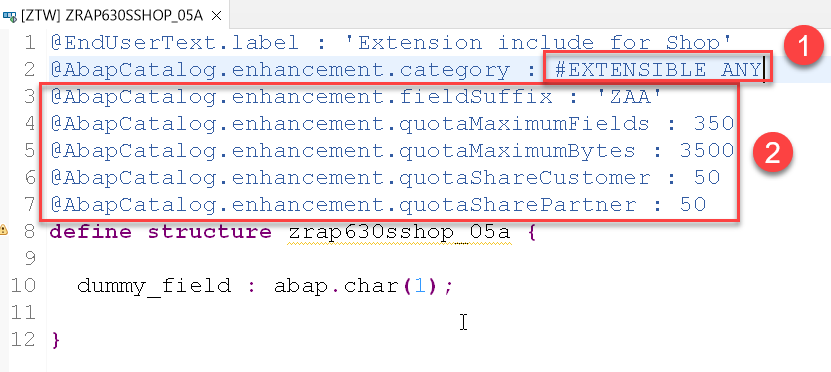

 </details>  
  
  ### Exercise 3.1.2 - Adapt the database table `zrap630_ashop###` of the RAP base BO

We now have to adapt the table of the generated RAP Business BO. This is again because the XCO libraries currently do not yet allow to set this annotations. 
Since we have already extended the IncludeStructure we also get error messages that provide a hint that the current table settings to not fit anymore.  


<details>
  <summary>🔵 Click to expand!</summary>

1. Open the generated table `zrap630_ashop###` and change the enhancement category from `#NOT_EXTENSIBLE` to the value `#EXTENSIBLE_ANY`.
     
   <pre>
   @AbapCatalog.enhancement.category : #EXTENSIBLE_ANY
   </pre>

   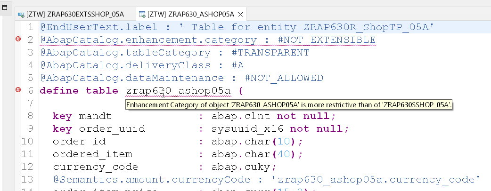
   
2. The source code of your table should now read as follows:   

<pre>
@EndUserText.label : ' Table for entity ZRAP630R_ShopTP_###'
@AbapCatalog.enhancement.category : #EXTENSIBLE_ANY
@AbapCatalog.tableCategory : #TRANSPARENT
@AbapCatalog.deliveryClass : #A
@AbapCatalog.dataMaintenance : #NOT_ALLOWED
define table zrap630_ashop### {

  key mandt             : abap.clnt not null;
  key order_uuid        : sysuuid_x16 not null;
  order_id              : ad_persnum;
  ordered_item          : abap.char(40);
  currency_code         : abap.cuky;
  @Semantics.amount.currencyCode : 'zrap630_ashop###.currency_code'
  order_item_price      : abap.curr(11,2) not null;
  delivery_date         : abap.dats;
  overall_status        : abap.char(30);
  notes                 : abap.char(256);
  last_changed_at       : abp_lastchange_tstmpl;
  created_by            : abp_creation_user;
  created_at            : abp_creation_tstmpl;
  local_last_changed_by : abp_locinst_lastchange_user;
  local_last_changed_at : abp_locinst_lastchange_tstmpl;
  include zrap630sshop_###;

}


</pre>

</details>

### Exercise 3.1.3 Adapt the draft table

Perform the same change for the draft table `zrap630sh00d_###` and change the enhancement category to the value `extensible_any`. 

<details>
  <summary>🔵 Click to expand!</summary>

<pre>
@AbapCatalog.enhancement.category : #EXTENSIBLE_ANY
</pre>

The source code of your draft table `zrap630sh00d_###` should now read as follows:   

<pre>
@EndUserText.label : ' Draft table for entity ZRAP630R_ShopTP_###'
@AbapCatalog.enhancement.category : #EXTENSIBLE_ANY
@AbapCatalog.tableCategory : #TRANSPARENT
@AbapCatalog.deliveryClass : #A
@AbapCatalog.dataMaintenance : #NOT_ALLOWED
define table zrap630sh00d_### {

  key mandt          : abap.clnt not null;
  key orderuuid      : sysuuid_x16 not null;
  orderid            : ad_persnum;
  ordereditem        : abap.char(40);
  currencycode       : abap.cuky;
  @Semantics.amount.currencyCode : 'zrap630sh00d_###.currencycode'
  orderitemprice     : abap.curr(11,2);
  deliverydate       : abap.dats;
  overallstatus      : abap.char(30);
  notes              : abap.char(256);
  lastchangedat      : abp_lastchange_tstmpl;
  createdby          : abp_creation_user;
  createdat          : abp_creation_tstmpl;
  locallastchangedby : abp_locinst_lastchange_user;
  locallastchangedat : abp_locinst_lastchange_tstmpl;
  "%admin"           : include sych_bdl_draft_admin_inc;
  include zrap630sshop_###;

}
</pre>

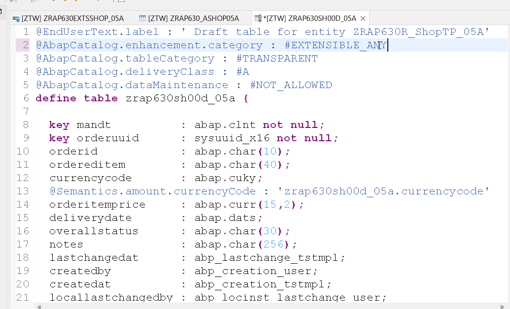

</details>

Since now the underlying base objects (active table, draft table and include structure) are extensible we can continue with exending the remaining objects of the stack.  

</details>

## Excercise 3.2 - Extend the data structure

As shown in the schematic view above we have to extend the following objects of our extensible base BO.

Since this is quite a lot of work we are currently developing a wizard that shall help to perform this tedious tasks more quickly.  
  
Order of extension | Repository object name | Name           | Comment  
-------- | ---------------------- | ------------------------ | -----------------------------------------------------   
1        | `ZRAP630SSHOP_###`     | Extension include        | extends active and draft table with additional fields    
2        | `ZRAP630E_Shop_###`    | Extension include view   | selects from (extended) active table   
3        | `ZRAP630R_ShopTP_###`  | Restricted base view     | selects from (2)   
4        | `ZRAP630C_ShopTP_###`  | CDS projection view      | selects from (3)   
5        | `ZRAP630I_ShopTP_###`  | Interface view           | selects from (3)   
6        | `ZRAP630R_Shop_D_###`  | Draft query view         | selects from (extended) draft table   


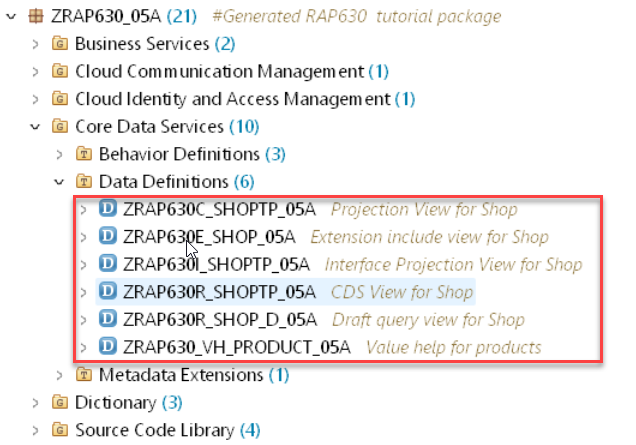  

<details>
  <summary>🔵 Click to expand!</summary>

### Exercise 3.2.1 - Extend the extension include with an append structure - Add a field

We start the extension of the base RAP BO by adding field to the _extension include structure_ by creating an _append structure_ .

<details>
  <summary>🔵 Click to expand!</summary>

1. Right click on the _extension include structure_ `ZRAP630SSSHOP_###` and choose **New Append Structure** from the context menue.
  
   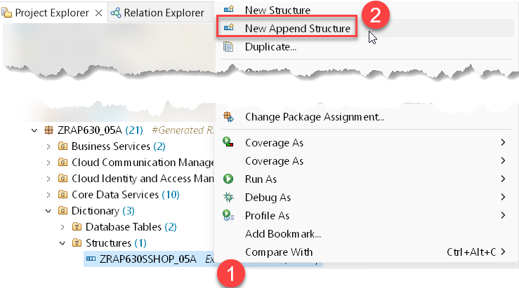
  
2. In the **New Append Structure** dialogue enter the following values.

   Be sure to change the package name to `ZRAP630_###_EXT` since the wizard in ADT by default propopses the package of the include structure of your base RAP BO.   
  
   Package:     `ZRAP630_###_EXT` !!!  
   Name:        `ZRAP630EXTSSHOP_###`  
   Description: Extend Extension Include Structure  
  
   and press **Next**.   
  
   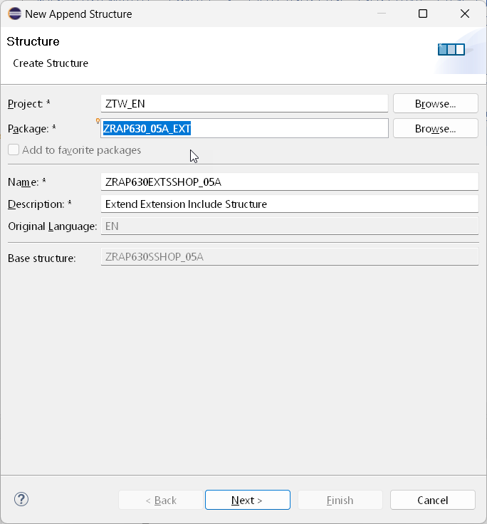

3. Select the transport request that has been created for your extension package and press **Finish**.  

   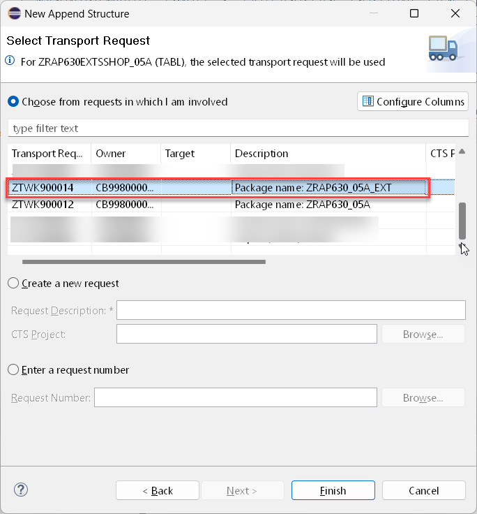
  
3. In the code editor enter the following code snippte  
  
   ```abap
      zz_feedback_zaa : abap.char(256);
   ```

  So that your code should read as follows:
  
  <pre>
  @EndUserText.label : 'Extend Extension Include Structure'
  @AbapCatalog.enhancement.category : #NOT_EXTENSIBLE
  extend type zrap630sshop_### with zrap630extsshop_05a {
  zz_feedback_zaa : abap.char(256);
  }
  </pre>

  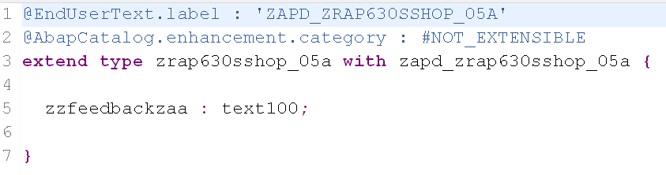
  
 4. Activate your changes
 
</details>

### Excercise 3.5 - Extend the CDS views 

In the following we will explain how to extend the remaining 5 CDS view entities. Since the process (the wizard) is the same for each CDS view entity we will only show screen shots for doing this for the first CDS view that has to be extended, which is the extension of the _Extension Include View_ `ZRAP630E_Shop_###`.  

For the remaining CDS views we will only provide the code snippets.   
  
<details>
  <summary>🔵 Click to expand!</summary>

### Exercise 3.5 - Extend the extenstion include view 

First we have to extend our extension include view `ZRAP630E_Shop_###` since the R-view reads from this view .
  
1. Right click on the CDS view of the base RAP business object that has to be extended. In this case right click on ´ZRAP630E_Shop_###´.   

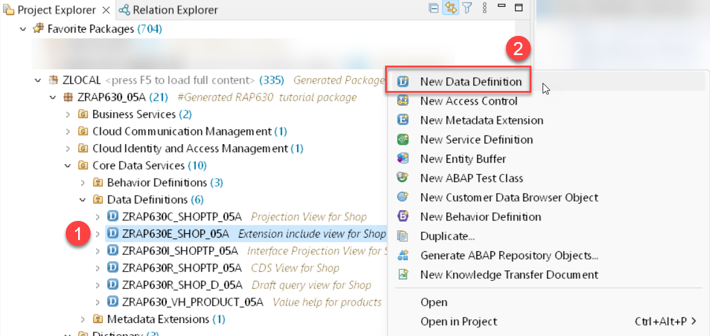 

2. Select **New Data Definition** from the context menu.

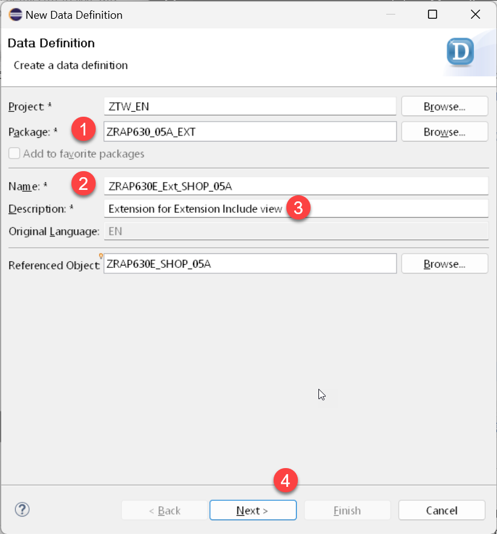 

3. In the **New Data Defintion** screen enter the following values:  

   Package: `ZRAP630_###_EXT` --> !!! Be sure to have changed the package name since ADT will propose the name of the package where your base RAP BO resides in

   Name: `ZRAP630E_Ext_Shop_###`
   Description: `Extension for Extension Include View`

   and press **Next** .

4. Select a transport request and press **Next**.
   
   > **Caution:**
   > Do **NOT** press finish, because on the following screen you have to select the template that shall be used.  
  
5. Select the template **Extend View Entity**  and press **Finish**     
    
4. The editor window opens. Here you have to enter the following code.
  
   <pre>      
     extend view entity ZRAP630E_Shop_### with {
         Shop.zz_feedback_zaa as zz_feedback_zaa
     } 
   </pre>
  
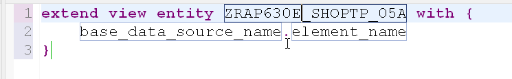
  

### Exercise 3.6 - Extend the remaining CDS views 
  
You have now to extend the remaining 4 CDS views in the following order with the following code snippets as we have done this for the extension include view in Exercise 3.5.   

#### Extension for R-CDS view

Name: `ZRAP630R_EXT_SHOPTP_###`   
Package: `ZRAP630_###_EXT`  
Description: Extension for R-CDS view

> **Please note:**
> The code extension of the R-CDS view reads from the `_Extension` association as the data source.
> All other extensions read from the alias `Shop` as the data source.    

<pre>
extend view entity ZRAP630R_ShopTP_### with {  
_Extension.zz_feedback_zaa as zz_feedback_zaa  
}
</pre> 
  
#### Extension for C-CDS view

Name: `ZRAP630C_EXT_SHOPTP_###`   
Package: `ZRAP630_###_EXT`  
Description: Extension for P-CDS view
  
<pre>
  extend view entity ZRAP630C_ShopTP_### with {  
  
  @UI.lineItem: [ {
    position: 140 , 
    importance: #MEDIUM, 
    label: 'Feedback'
    } ]
    @UI.identification: [ {
    position: 140 , 
    label: 'Feedback'
    } ]
  
   Shop.zz_feedback_zaa as zz_feedback_zaa  
   }
</pre>  
  
#### Extension for I-CDS view  

Name: `ZRAP630I_Ext_Shop_D_###`   
Package: `ZRAP630_###_EXT`  
Description: Extension for interface view
  
<pre>
extend view entity ZRAP630I_Shop_D_### with {  
Shop.zz_feedback_zaa as zz_feedback_zaa 
}
</pre>
  
    
####  Extension for draft query view

Name: `ZRAP630R_Ext_Shop_D_###`   
Package: `ZRAP630_###_EXT`  
Description: Extension for draft query view
  
<pre>
extend view entity ZRAP630R_Shop_D_### with {  
Shop.zz_feedback_zaa as zz_feedback_zaa 
}
</pre>
  
  
### Exercise 3.10 - Test the field extensibility

After having extended all the objects in the hiearchy of your base RAP business object you can now leverage the additional field in the UI.

1. Open the Service Binding of the extensible RAP business object and double-click on the entity**Shop**.   
  
2. Press the **Go** button.  
  
   You should see a new column called "Feedback".   
  
   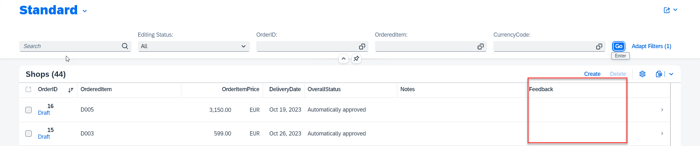  

3. Select one entry and use the **Edit** button
  
  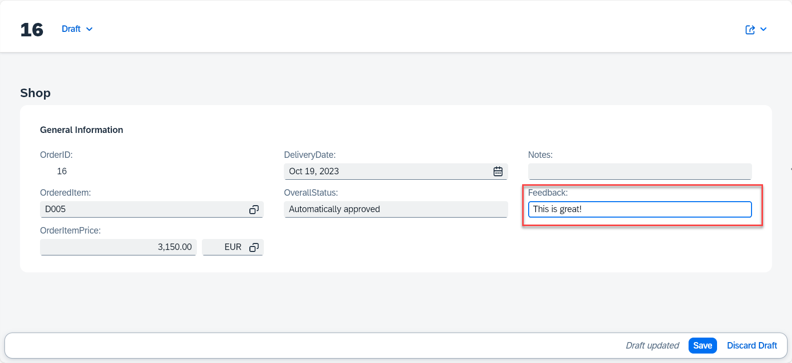   
  
  
  > When no field is visible you should check the extension of your projection view `ZRAP630C_EXT_SHOPTP_###` and check the UI annotations.   
  
  
</details>

</details>
  
## Summary

You have now added a single editable field to your extensible RAP business object.   
In the next execise we will show how to add an action. 

Continue to - [Exercise 4 - Add an action ](../ex4/README.md)


