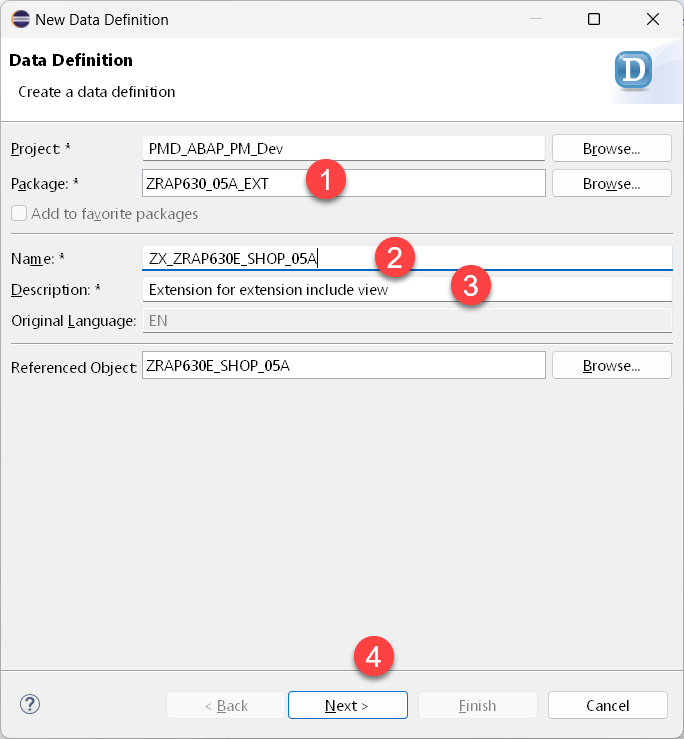
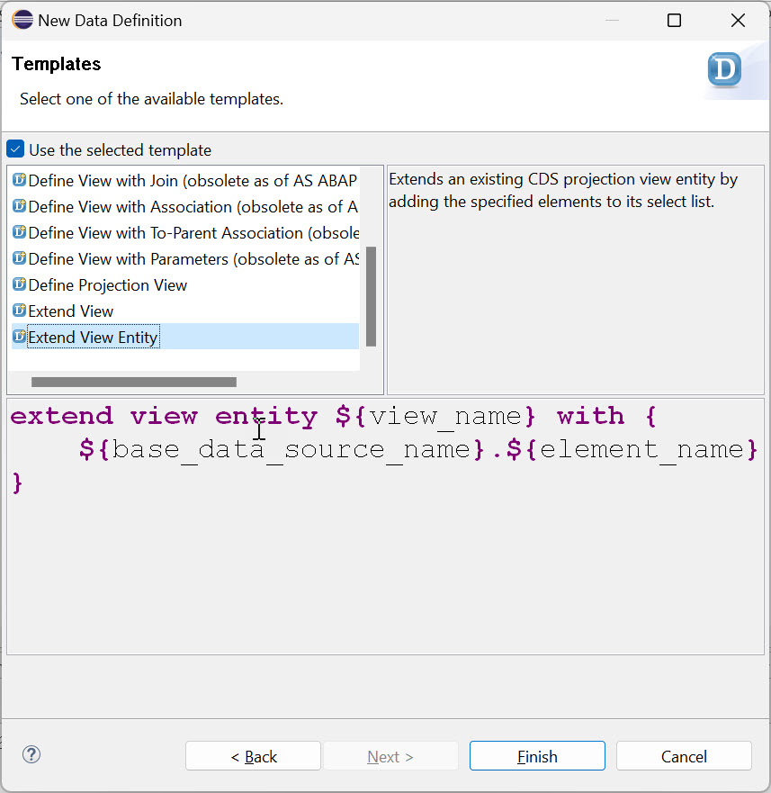

[Home - Cloud ERP Extensibility](../../../../#exercises)  

# Exercise 3 - Extend the CDS data model of the extensible RAP base business object  

As shown in the schematic view above we have to extend the following objects of our extensible base BO.
  
Order of extension | Repository object name | Name           | Comment  
-------- | ---------------------- | ------------------------ | -----------------------------------------------------   
1        | `ZRAP630SSHOP_###`     | Extension include        | extends active and draft table with additional fields    
2        | `ZRAP630E_Shop_###`    | Extension include view   | selects from (extended) active table   
3        | `ZRAP630R_ShopTP_###`  | Restricted base view     | selects from (2)   
4        | `ZRAP630C_ShopTP_###`  | CDS projection view      | selects from (3)   
5        | `ZRAP630I_ShopTP_###`  | Interface view           | selects from (3)   
6        | `ZRAP630R_Shop_D_###`  | Draft query view         | selects from (extended) draft table   


  


## Exercise 3.1 - Extend the extension include with an append structure - Add a field

We start the extension of the base RAP BO by adding field to the _extension include structure_ by creating an _append structure_ .

<details>
  <summary>🔵 Click to expand!</summary>

1. Right click on the _extension include structure_ `ZRAP630SSSHOP_###` and choose **New Append Structure** from the context menue.
  
   
  
2. In the **New Append Structure** dialogue enter the following values.

   Be sure to change the package name to `ZRAP630_###_EXT` since the wizard in ADT by default propopses the package of the include structure of your base RAP BO.   
  
   Package:     `ZRAP630_###_EXT` ⚠️  
   Name:        `ZAPD_ZRAP630SSHOP_###`  
   Description: Extend Extension Include Structure  
  
   and press **Next**.   

3. Select the transport request that has been created for your extension package and press **Finish**.  
  
3. In the code editor enter the following code snippet   
  
   ```abap
      zzfeedbackzaa : text100;
   ```

   So that your code should read as follows:
  
   <pre lang="ABAP">  
   @EndUserText.label : 'extend ZRAP630SSHOP_###'
   @AbapCatalog.enhancement.category : #NOT_EXTENSIBLE
   extend type zrap630sshop_05a with zapd_zrap630sshop_### {
    zzfeedbackzaa : text100;
   }
   </pre>
  
 
 4. Activate your changes
 
</details>

## Excercise 3.2 - Extend the extension include view  

In the following we will explain how to extend the remaining 5 CDS view entities. Since the process (the wizard) is the same for each CDS view entity we will only show screen shots for doing this for the first CDS view that has to be extended, which is the extension of the _Extension Include View_ `ZRAP630E_Shop_###`.  

For the remaining CDS views we will only provide the code snippets.   
  
<details>
  <summary>🔵 Click to expand!</summary>

First we have to extend our extension include view `ZRAP630E_Shop_###` since the R-view reads from this view .
  
1. Right click on the CDS view of the base RAP business object that has to be extended. In this case right click on ´ZRAP630E_Shop_###´.   

     

2. Select **New Data Definition** from the context menu.

       

3. In the **New Data Defintion** screen enter the following values:  

   Package: `ZRAP630_###_EXT` --> !!! Be sure to have changed the package name since ADT will propose the name of the package where your base RAP BO resides in

   Name: `ZX_ZRAP630E_SHOP_###`
   Description: `Extension for Extension Include View`

   and press **Next** .

4. Select a transport request and press **Next**.
   
   > **Caution:**
   > Do **NOT** press finish, because on the following screen you have to select the template that shall be used.  
  
5. Select the template **Extend View Entity**  and press **Finish**     
    
     
    
6. The editor window opens. Here you have to enter the following code.
  
   <pre lang="ABAP">      
     extend view entity ZRAP630E_Shop_### with {
         Shop.zz_feedback_zaa as zz_feedback_zaa
     } 
   </pre>
  
    
  
</details>

## Excercise 3.3 - Extend the remaining CDS views 
  
You have now to extend the remaining 4 CDS views in the following order with the following code snippets as we have done this for the extension include view in Exercise 3.5.   

<details>
  <summary>🔵 Click to expand!</summary>

### Extension for R-CDS view

Name: `ZX_ZRAP630R_SHOPTP_###`   
Package: `ZRAP630_###_EXT`  
Description: Extension for R-CDS view

> **Please note:**
> The code extension of the R-CDS view reads from the `_Extension` association as the data source.
> All other extensions read from the alias `Shop` as the data source.    

```abap
extend view entity ZRAP630R_SHOPTP_### with 
{
  @EndUserText.label: 'Feedback'
  _EXTENSION.ZZFEEDBACKZAA as ZZFEEDBACKZAA
}
```
  
### Extension for C-CDS view

Name: `ZX_ZRAP630C_SHOPTP_###`   
Package: `ZRAP630_###_EXT`  
Description: Extension for P-CDS view
  
```abap
extend view entity ZRAP630C_SHOPTP_### with 
{
  @EndUserText.label: 'Feedback'
  @UI.dataFieldDefault: [{hidden: false}]
  @UI.identification: [{hidden: false}]
  @UI.lineItem: [{hidden: false}]
  SHOP.ZZFEEDBACKZAA as ZZFEEDBACKZAA

}
``` 
  
### Extension for I-CDS view  

Name: `ZX_ZRAP630I_SHOPTP_###`   
Package: `ZRAP630_###_EXT`  
Description: Extension for interface view
  
```abap
extend view entity ZRAP630I_SHOPTP_### with 
{
  @EndUserText.label: 'Feedback'
  SHOP.ZZFEEDBACKZAA as ZZFEEDBACKZAA

}
```
  
    
###  Extension for draft query view

Name: `ZX_ZRAP630R_SHOP_D_###`   
Package: `ZRAP630_###_EXT`  
Description: Extension for draft query view
  
```ABAP
extend view entity ZRAP630R_SHOP_D_### with 
{
  SHOP.ZZFEEDBACKZAA as ZZFEEDBACKZAA

}
```

</details>


#### Result

The extension project should now look like as follows:   


No.      | Extension repository object | Extended repository object       | Comment  
-------- | ------------------------- | ------------------------ | -----------------------------------------------------   
1        | `ZAPD_ZRAP630SSHOP_###`   | `ZRAP630SSHOP_###`       | extends extension include structure 
2        | `ZX_ZRAP630E_SHOP_###`    | `ZRAP630E_Shop_###`      | extends extension include view   
3        | `ZX_ZRAP630R_SHOPTP_###`  | `ZRAP630R_ShopTP_###`    | extends restricted transcational base view   
4        | `ZX_ZRAP630C_SHOPTP_###`  | `ZRAP630C_ShopTP_###`    | extends transactional projection view
5        | `ZX_ZRAP630I_SHOPTP_###`  | `ZRAP630I_ShopTP_###`    | extends transactional interface view 
6        | `ZX_ZRAP630R_SHOP_D_###`  | `ZRAP630R_Shop_D_###`    | extends draft query view
  


### Exercise 3.3 - Test the field extensibility

After having extended all the objects in the hiearchy of your base RAP business object you can now leverage the additional field in the UI.

<details>
  <summary>🔵 Click to expand!</summary>

1. Open the Service Binding of the extensible RAP business object and double-click on the entity**Shop**.   
  
2. Press the **Go** button.  
  
   You should see a new column called "Feedback".   
  
     

3. Select one entry and use the **Edit** button
  
      
  
  
  > When no field is visible you should check the extension of your projection view `ZRAP630C_EXT_SHOPTP_###` and check the UI annotations.   

</details>

## Summary

You have now added a single editable field to your extensible RAP business object.   
In the next execise we will show how to add an action. 

Continue to - [Exercise 4 - Add an action ](../ex4/README.md)


