[Home - Cloud ERP Extensibility](../../../../#exercises)  

# Exercise 3 - Extend the CDS data model using the field extension wizard 

The **extension field wizard** can be started from the consumption (c-view) or interface projection view (i-view) or from the underlying restricted base view (r-view). Depending on which view is used as the starting point certain options are pre-set in the wizard. 

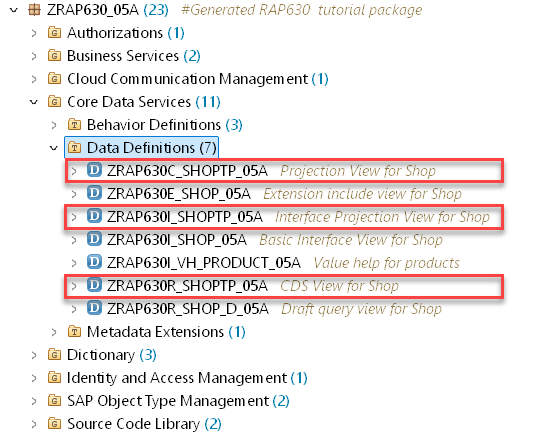   

When for example using the C-view as the entry point the wizard will suggest to extend the C-view by default.

## Excercise 3.1 - Extend the data structure with the extension field wizard

1. Right click on the consumption projection view `ZRAP630C_ShopTP_###` (the one with the statement `provider contract TRANSACTIONAL_QUERY` ) and choose **Generate ABAP Repository Objects ..**.

   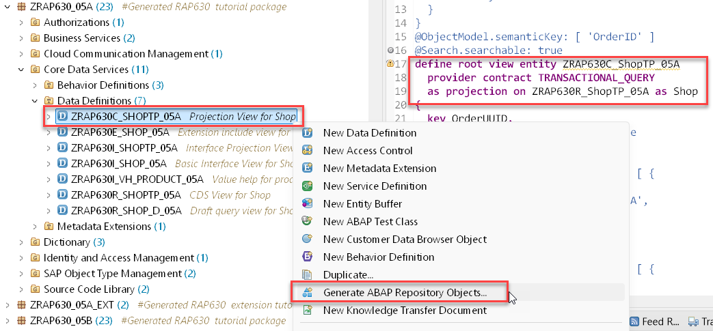 

3. In the **Select Generator** screen choose **ABAP Cloud: Extensibility** and then **Extension Fields**. Press **Next**.

   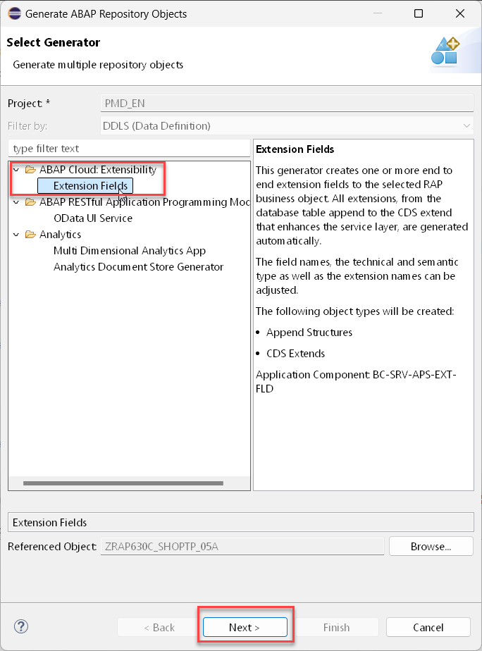   
  
4. In the **Enter Package** screen enter the name of the package `ZRAP630_###_EXT` and press **Next**.

   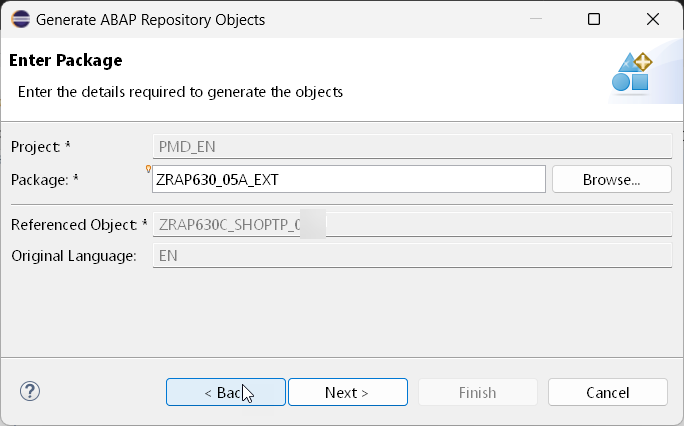 

5. In the **Configure Generator** screen press **Add** (1). Then, in the **Add Field** dialogue enter the following values (2) to add a field to enter feedback:   

   - Name `ZZFEEDBACKZAA`  
   - Label: `Feedback`  
   - Data Elemeent: `TEXT100`  
   - Activate the check box **Generate UI annotations**   (3)
  
   and press **Add** (4)

   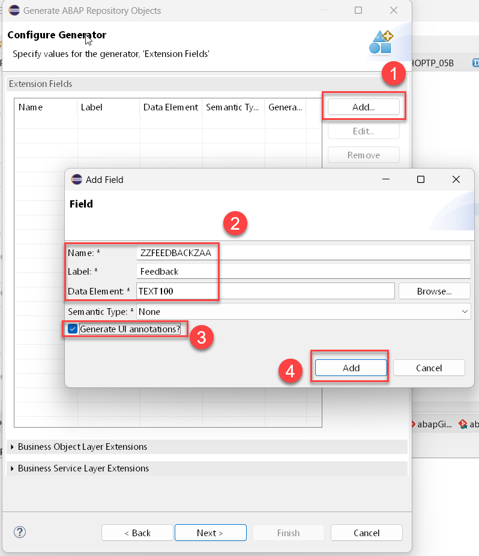  
 
6. Expand the section **Business Service Layer Extensions** and verify that the option **Extend Object ?** is checked and press **Next**.   

   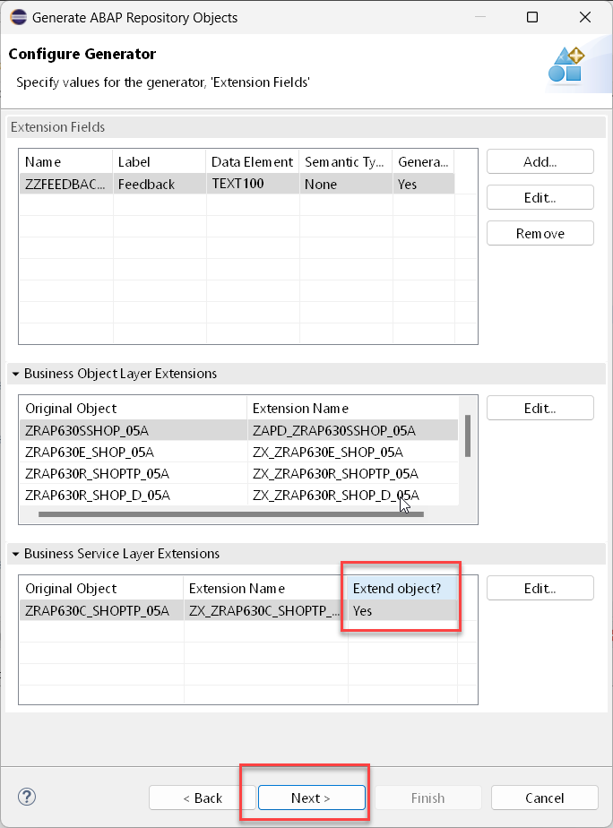  
  
7. The wizard now shows the list of ABAP Artifacts that are going to be created / modified.

   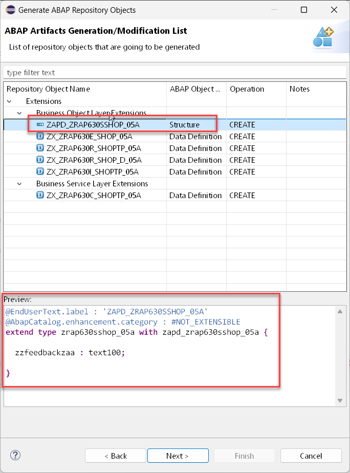

   You can check out the code for also for the other artifacts that are going to be generated

   <details>
     <summary>🔵 Click to show other artifacts</summary>

     ### Extension include structure 
 
     

     ### Extension include view
 
     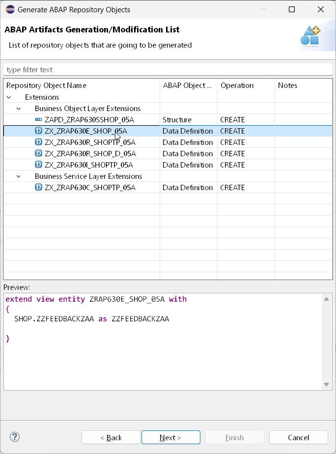


     ### Extension for draft query view
    
     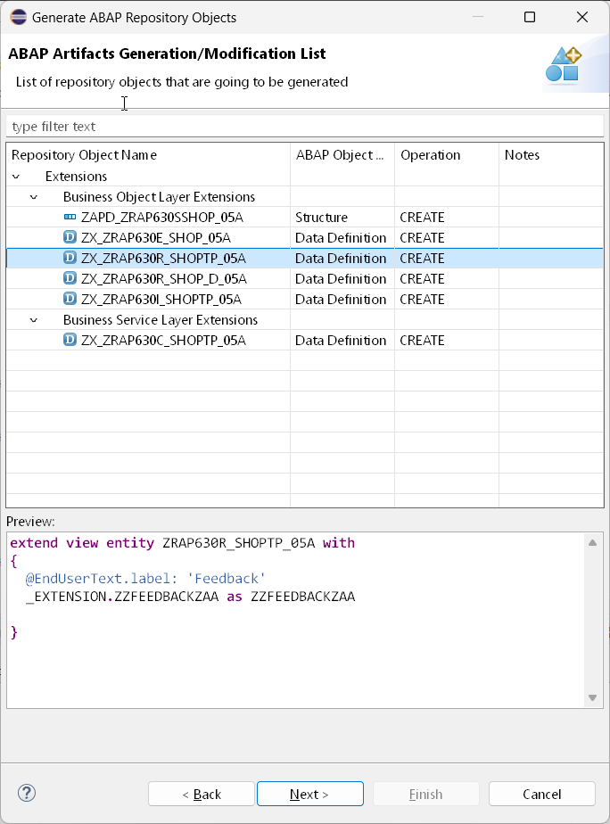

     ### Extension for base restricted view 
    
     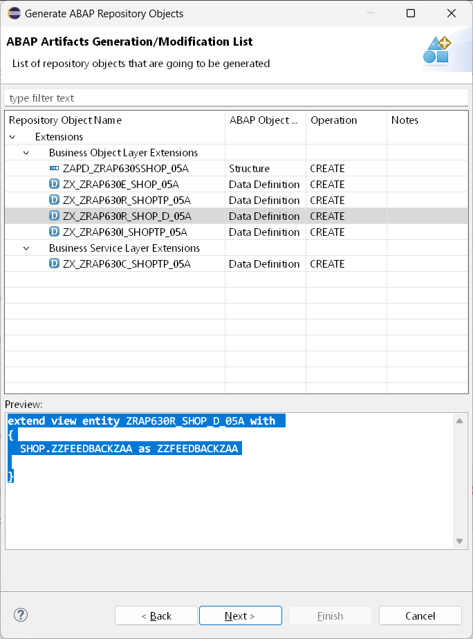

     ### Extension for tranactional interface view
    
     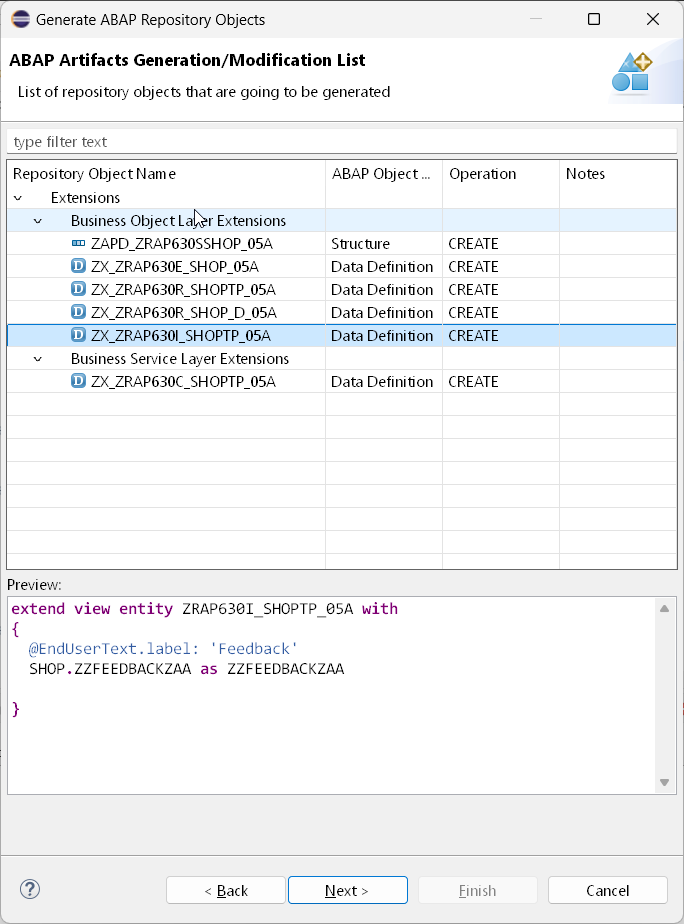

     ### Extension for tranactional consumption view 
    
     

<!--
120

```abap
@EndUserText.label : 'ZAPD_ZRAP630SSHOP_05A'
@AbapCatalog.enhancement.category : #NOT_EXTENSIBLE
extend type zrap630sshop_05a with zapd_zrap630sshop_05a {

  zzfeedbackzaa : text100;

}
```

130

```abap
extend view entity ZRAP630E_SHOP_05A with 
{
  SHOP.ZZFEEDBACKZAA as ZZFEEDBACKZAA

}
```     

140

```abap
extend view entity ZRAP630R_SHOPTP_05A with 
{
  @EndUserText.label: 'Feedback'
  _EXTENSION.ZZFEEDBACKZAA as ZZFEEDBACKZAA

}
```

150
```ABAP
extend view entity ZRAP630R_SHOP_D_05A with 
{
  SHOP.ZZFEEDBACKZAA as ZZFEEDBACKZAA

}
```


160

```abap
extend view entity ZRAP630I_SHOPTP_05A with 
{
  @EndUserText.label: 'Feedback'
  SHOP.ZZFEEDBACKZAA as ZZFEEDBACKZAA

}
```

170

here UI annotations have been added

```abap
extend view entity ZRAP630C_SHOPTP_05A with 
{
  @EndUserText.label: 'Feedback'
  @UI.dataFieldDefault: [{hidden: false}]
  @UI.identification: [{hidden: false}]
  @UI.lineItem: [{hidden: false}]
  SHOP.ZZFEEDBACKZAA as ZZFEEDBACKZAA

}
```

--> 

8. Press  **Next** to continue

9. Select a transport request


## Excercise 3.2 - Check the data structure extension

The wizard has generated the following repository objects:   

  
No.      | Extension repository object | Extended repository object       | Comment  
-------- | ------------------------- | ------------------------ | -----------------------------------------------------   
1        | `ZAPD_ZRAP630SSHOP_###`   | `ZRAP630SSHOP_###`       | extends extension include structure 
2        | `ZX_ZRAP630E_SHOP_###`    | `ZRAP630E_Shop_###`      | extends extension inlcude view   
3        | `ZX_ZRAP630R_SHOPTP_###`  | `ZRAP630R_ShopTP_###`    | extends restricted transcational base view   
4        | `ZX_ZRAP630C_SHOPTP_###`  | `ZRAP630C_ShopTP_###`    | extends transactional projection view
5        | `ZX_ZRAP630I_SHOPTP_###`  | `ZRAP630I_ShopTP_###`    | extends transactional interface view 
6        | `ZX_ZRAP630R_SHOP_D_###`  | `ZRAP630R_Shop_D_###`    | extends draft query view

The extension project should now look like as follows:   

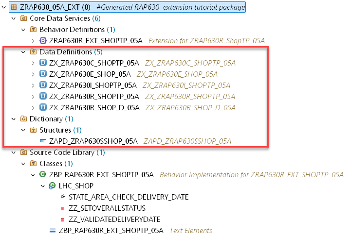

### Exercise 3.3 - Test the field extensibility

After having extended all the objects in the hiearchy of your base RAP business object you can now leverage the additional field in the UI.

<details>
  <summary>🔵 Click to expand!</summary>

1. Open the Service Binding of the extensible RAP business object and double-click on the entity**Shop**.   
  
2. Press the **Go** button.  
  
   You should see a new column called "Feedback".   
  
     

3. Select one entry and use the **Edit** button
  
      
  
  
  > Hint:   
  > ⚠️ When no field is visible you should check the extension of your projection view `ZX_ZRAP630C_SHOPTP_###` and check the UI annotations.   

</details>

## Summary

You have now added a single editable field to your extensible RAP business object.   
In the next execise we will show how to add an action. 

Continue to - [Exercise 4 - Add an action ](../ex4/README.md)


