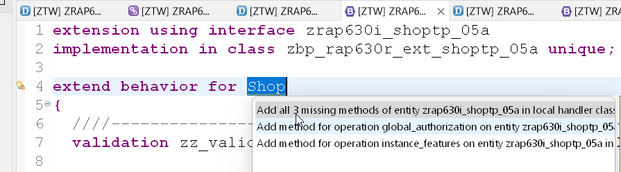
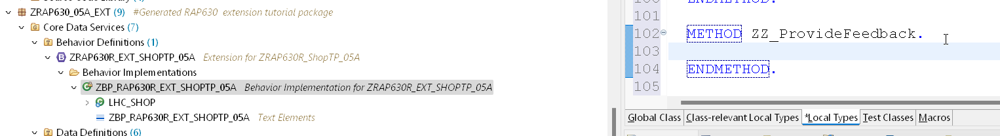
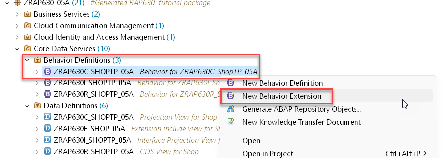
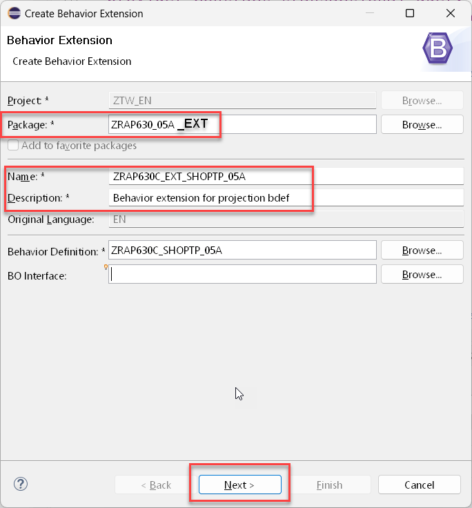
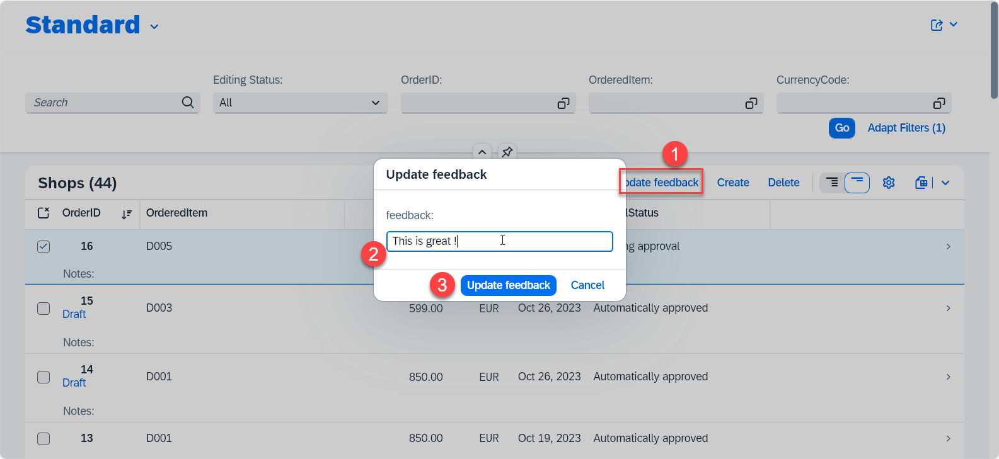

# Exercise 4 - Extend the business object with an action 

After having added a field we will add an action to the base RAP BO. This action will be used to update comments. We will make the new field read-only 
and add the required extensions to the 
- BDEF (add the action)
- Projection BDEF (add a use statement)
- Projection view (add UI annotations to make the button of the action visible)

### Exercise 4.1 Create an abstract entity

We want to provide the feedback for an order as a parameter of an action that will be added as an extenstion.
Parameters are passed to the action using abstract entites.

1. Right click on the folder **Data Definition** in your package `ZRAP630_###_EXT` 
2. Choose **New data defintion** from the context menu  
   - Package: `ZRAP630_###_EXT`  
   - Name: `ZRAP630_A_Feedback_###`   
   - Description: `Pass feedback as a parameter`  
   and press **Next**   
5. Select the template **Define abstract entity with parameters** and press **Finish**  
6. Enter the following coding

<pre>
@EndUserText.label: 'Pass feedback as a parameter'
define abstract entity ZRAP630_A_Feedback_###  
{
    feedback : abap.char(100);  
}
</pre>    

7. Activate your changes   

### Exercise 4.2 Extend the behavior definition 

Now we can define the action with the parameter that has just been created.  

1. Open the behavior extension `ZRAP630R_EXT_SHOPTP_###` 
2. Add the following code snippet in your behavior extension `ZRAP630R_EXT_SHOPTP_###`  

  <pre>
  field(readonly) zz_feedback_zaa;
  action(authorization : global, features : instance ) ZZ_ProvideFeedback  parameter ZRAP630_A_Feedback_### result[1] $self;
  </pre> 
  
  so that your code now reads
  
  <pre>
  extension using interface zrap630i_shoptp_###
implementation in class zbp_rap630r_ext_shoptp_### unique;

extend behavior for Shop
{

  validation zz_validateDeliverydate on save { create; field DeliveryDate; }

  extend draft determine action Prepare
  {
    validation zz_validateDeliveryDate;
  }
  determination ZZ_setOverallStatus on modify { field OrderedItem; }

  side effects { field OrderedItem affects field OrderItemPrice , field CurrencyCode ; }

  field(readonly) zz_feedback_zaa;
  action(authorization : global, features : instance ) ZZ_ProvideFeedback  parameter ZRAP630_A_Feedback_### result[1] $self;
}
  </pre>

3. Use the code assist (Press Ctrl+1) on the **Shop** entity and let the framework generate the missing artefacts.

 

### Exercise 4.3. - Implement the method for the action in the behvior implementation class

1. Open the local class of the behavior implementation class.

2. Implement the method zz_providefeedback and activate your changes

<pre>
METHOD ZZ_ProvideFeedback.
    MODIFY ENTITIES OF ZRAP630I_ShopTP_### IN LOCAL MODE
  ENTITY Shop

  UPDATE FIELDS ( zz_feedback_zaa )
  WITH VALUE #( FOR key IN keys ( %tky              = key-%tky
                                   zz_feedback_zaa  = key-%param-feedback  ) ).

    "Read the changed data for action result
    READ ENTITIES OF ZRAP630I_ShopTP_### IN LOCAL MODE
      ENTITY Shop
        ALL FIELDS WITH
        CORRESPONDING #( keys )
      RESULT DATA(result_read).
    "return result entities
    result = VALUE #( FOR order_2 IN result_read ( %tky   = order_2-%tky
                                                   %param = order_2 ) ).

  ENDMETHOD.
</pre>

### Exercise 4.4 - Extend the projection BDEF

In order to make the action visible an appropriate `use action` statement has to added to the projection level of the BDEF of the extensible root BO.

1. Right click on the projection behavior definition `ZRAP630_C--` within the package `ZRAP630_###` and select **New Behavior Extension**  
   
      

2. Fill in the data for the projection behavior extension

   - Package: `ZRAP630_###_EXT` 
   - Name: `ZRAP630C_Ext_SHOPTP_###`
   - Description: Behavior extension for projection bdef   

     

3. Select a transport and press **Finish**  

4. Enter a use statement for your action so that the code looks like 

<pre>
extension for projection;

extend behavior for Shop
{
use action ZZ_ProvideFeedback;
}
</pre>

### Exercise 4.5 - Add UI annotation

UI annotations have to be added to make the action button visible. This is done in the C-View Extension `ZRAP630C_EXT_SHOPTP_###`.   

For this you have to add the following code snippet to the UI annotatoins.

<pre>, { type: #FOR_ACTION, dataAction: 'ZZ_ProvideFeedback', label: 'Update feedback' } </pre>

so that the code of `ZRAP630C_EXT_SHOPTP_###` now reads

<pre>
extend view entity ZRAP630C_ShopTP_05C with
{
  @UI.lineItem: [ {
   position: 140 ,
   importance: #MEDIUM,
   label: 'Feedback'
  }
  , { type: #FOR_ACTION, dataAction: 'ZZ_ProvideFeedback', label: 'Update feedback' } 
  ]
  @UI.identification: [ {
  position: 140 ,
  label: 'Feedback'
 } ]
  Shop.zz_feedback_zaa as zz_feedback_zaa
}
</pre>

You should now see an action button that allows you to enter feedback.

## Summary

You've now finished.
